# Platforms

Swiftfin on iOS, iPadOS, and tvOS.

<b>Home</b>

 
<table>
  <tr>
    <th>iOS</th>
    <th>iPadOS</th>
    <th>tvOS</th>
  </tr>
  <tr>
    <td align="center">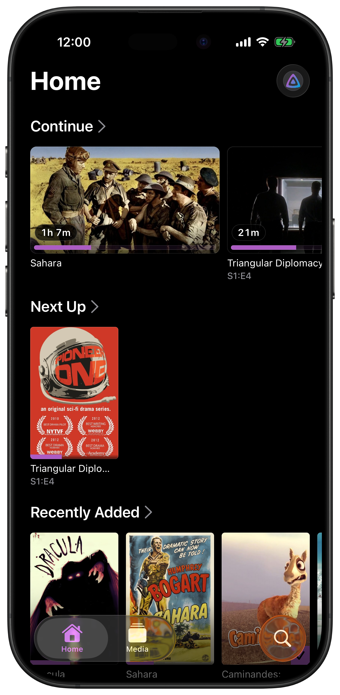</td>
    <td align="center">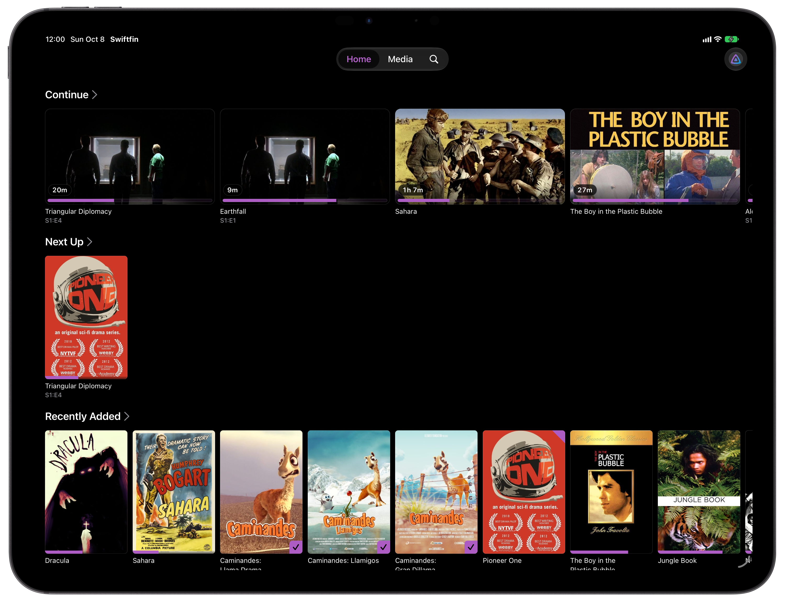</td>
    <td align="center"></td>
  </tr>
</table>

<b>Media</b>

 
<table>
  <tr>
    <th>iOS</th>
    <th>iPadOS</th>
    <th>tvOS</th>
  </tr>
  <tr>
    <td align="center"></td>
    <td align="center">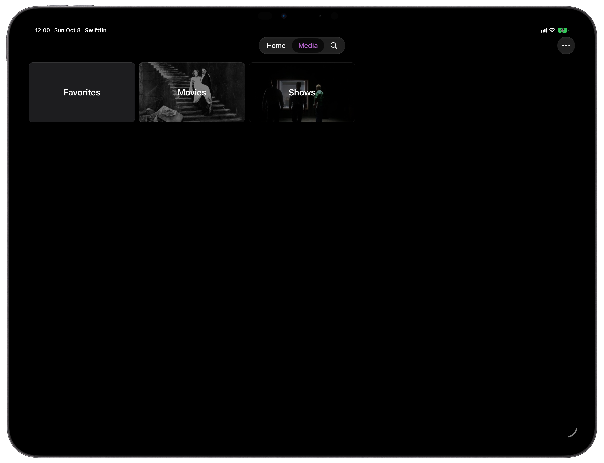</td>
    <td align="center"></td>
  </tr>
</table>

<b>Library</b>

 
<table>
  <tr>
    <th>iOS</th>
    <th>iPadOS</th>
    <th>tvOS</th>
  </tr>
  <tr>
    <td align="center">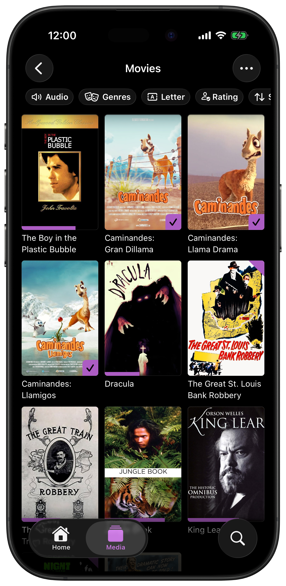</td>
    <td align="center">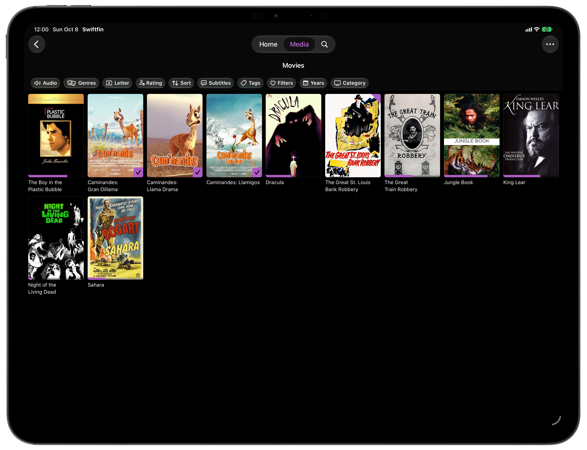</td>
    <td align="center"></td>
  </tr>
</table>

<b>Movie</b>

 
<table>
  <tr>
    <th>iOS</th>
    <th>iPadOS</th>
    <th>tvOS</th>
  </tr>
  <tr>
    <td align="center">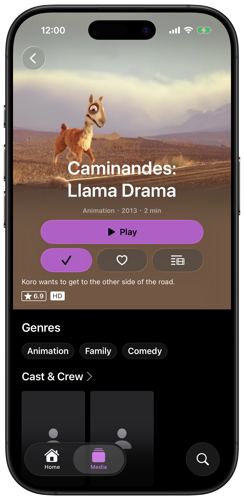</td>
    <td align="center"></td>
    <td align="center"></td>
  </tr>
</table>

<b>Series</b>

 
<table>
  <tr>
    <th>iOS</th>
    <th>iPadOS</th>
    <th>tvOS</th>
  </tr>
  <tr>
    <td align="center"></td>
    <td align="center">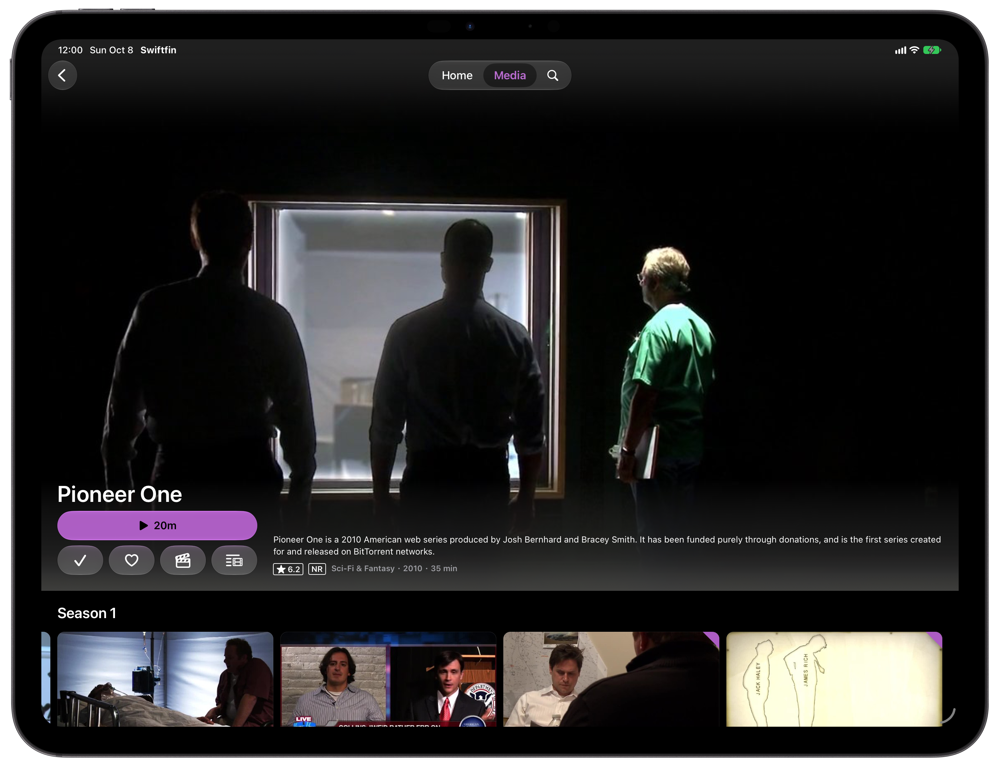</td>
    <td align="center"></td>
  </tr>
</table>

<b>Episode</b>

 
<table>
  <tr>
    <th>iOS</th>
    <th>iPadOS</th>
    <th>tvOS</th>
  </tr>
  <tr>
    <td align="center">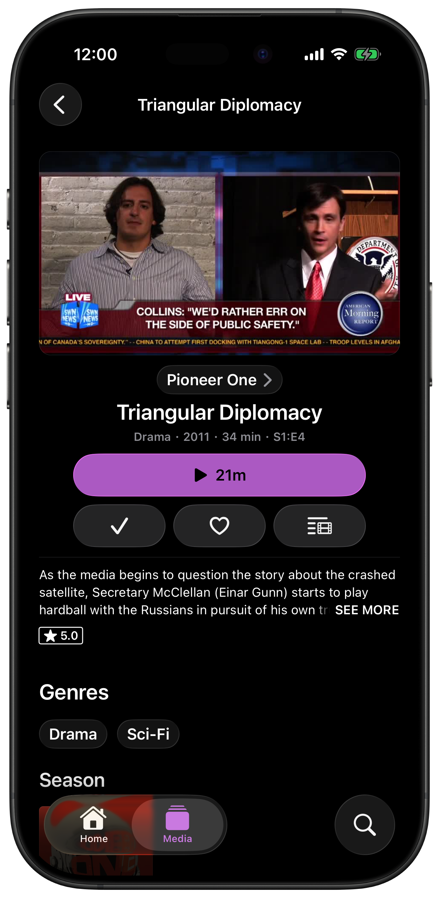</td>
    <td align="center">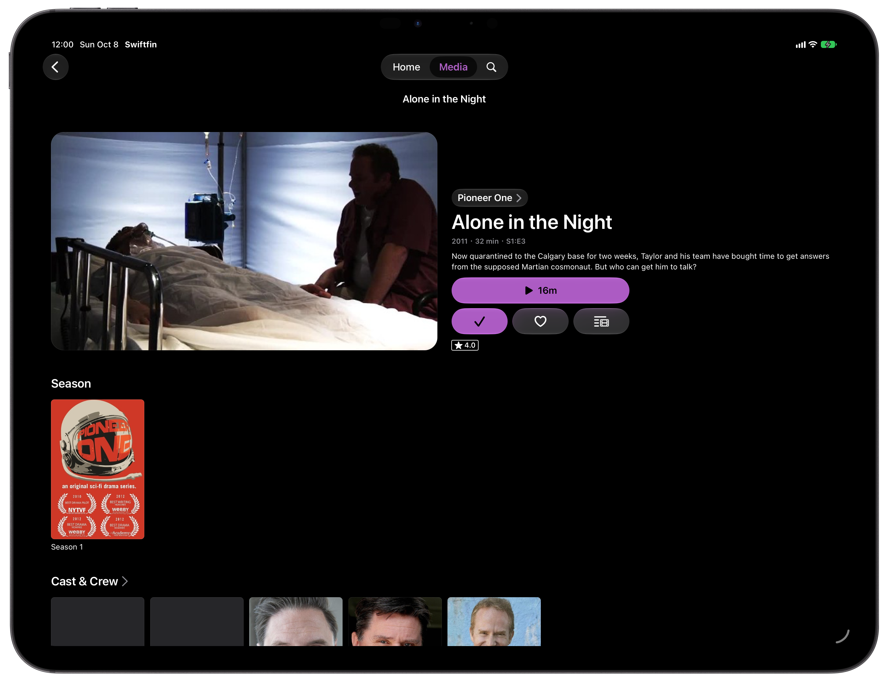</td>
    <td align="center"></td>
  </tr>
</table>

<b>User Selection</b>

 
<table>
  <tr>
    <th>iOS</th>
    <th>iPadOS</th>
    <th>tvOS</th>
  </tr>
  <tr>
    <td align="center"></td>
    <td align="center"></td>
    <td align="center"></td>
  </tr>
</table>

<b>Playback</b>

 
<table>
  <tr>
    <th>iOS</th>
    <th>iPadOS</th>
    <th>tvOS</th>
  </tr>
  <tr>
    <td align="center">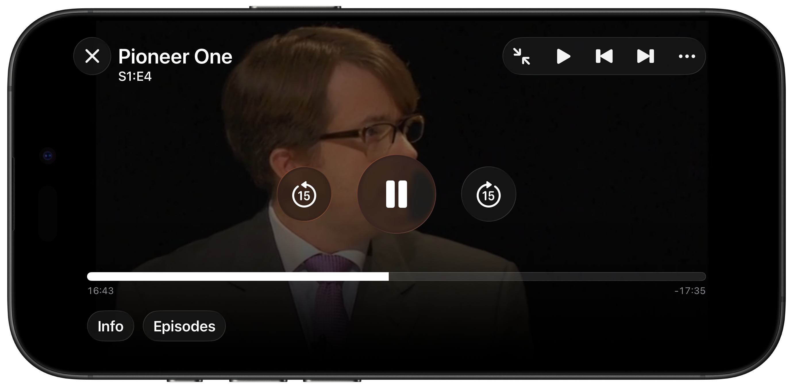</td>
    <td align="center">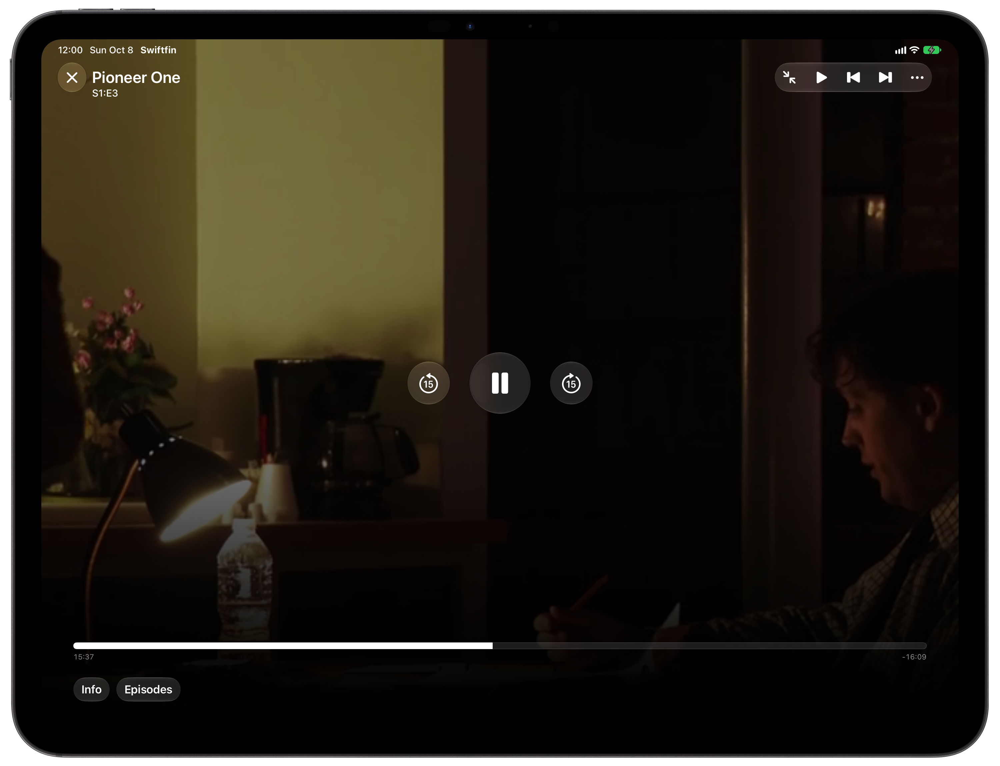</td>
    <td align="center"></td>
  </tr>
</table>

