

  

  <h1>Project GuamaFlix</h1>

  
  
  
  

  <b>GuamaFlix</b> is a native <b>Apple TV</b> client for the <a href="https://github.com/jellyfin/jellyfin">Jellyfin</a> media server — a polished, focus-first tvOS experience built on top of <a href="https://github.com/jellyfin/Swiftfin">Swiftfin</a>, with direct play powered by <b>AVPlayer</b> and <b>VLC</b>.

---

## ✨ About

GuamaFlix is a **tvOS-only** rebuild of the Swiftfin Jellyfin client, redesigned from the ground up around Apple's **Liquid Glass** design language — translucent depth, fluid focus and motion, and a cinematic, full-bleed home. It connects to your own Jellyfin server — your library, your account, your data.

> [!NOTE]
> GuamaFlix targets **tvOS 26+** and is built native-first with the latest Apple APIs. There is no iOS build.

## 🎬 Features

GuamaFlix reads what your Jellyfin server already has configured and renders it natively on Apple TV — no extra setup — and a live connection keeps everything in sync in **real time**.

### 🧩 Plugins & integrations

GuamaFlix automatically detects and uses whichever of these your server runs:

- **[Home Screen Sections](https://github.com/IAmParadox27/jellyfin-plugin-home-sections)** — renders your configured home rows natively, in the exact order and grouping you set up.
- **[Collection Sections](https://github.com/IAmParadox27/jellyfin-plugin-collection-sections)** — surfaces your collections and playlists (Trending, Most Watched, Award Winning…) as native home rows.
- **[KefinTweaks](https://github.com/n00bcodr/KefinTweaks)** — honors its home-screen layout and tweaks, mapped to native rows.
- **[Media Bar](https://github.com/IAmParadox27/jellyfin-plugin-media-bar)** — features its configured playlist as the cinematic, auto-rotating spotlight.
- **[Jellyfin Enhanced](https://github.com/n00bcodr/Jellyfin-Enhanced)** — applies your server's custom branding (admin logo + splash).
- **[Intro Skipper](https://github.com/intro-skipper/intro-skipper)** — on-screen **Skip Intro / Skip Credits** during playback.
- **[Seerr](https://github.com/seerr-team/seerr)** — search for and request new movies and shows right from the app.
- **SyncPlay** — watch in sync with friends across devices, with join/leave notifications.
- **Live TV** — a full cable-box EPG guide with channel logos and a live now-line.
- **Trickplay** — smooth scrubbing-preview thumbnails on the playback timeline.
- **Episode Preview** — preview stills while browsing episodes.
- **[Open Subtitles](https://github.com/jellyfin/jellyfin-plugin-opensubtitles)** *(in progress)* — on-demand subtitle downloads.

Anything your server doesn't run falls back to a clean default.

### 👤 Multiple users & servers

Sign in to several Jellyfin servers at once and switch between accounts from a single, unified Users screen — each account shown with the profile picture pulled from its own server.

### ⚡ Also built in

- **Liquid Glass interface** — Apple's translucent design with fluid focus, parallax, and depth.
- **Real-time updates** — a persistent **WebSocket** connection keeps watch state, playback progress, SyncPlay, and requests live across devices.
- **Hybrid playback** — HDR / Dolby Vision through Apple's native **AVPlayer**; everything else via **VLC** for maximum direct-play compatibility.
- **Top Shelf** — Continue Watching and Next Up surfaced on the Apple TV Home screen.

## 📸 Screenshots

<table>
  <tr>
    <td width="50%" valign="top">
      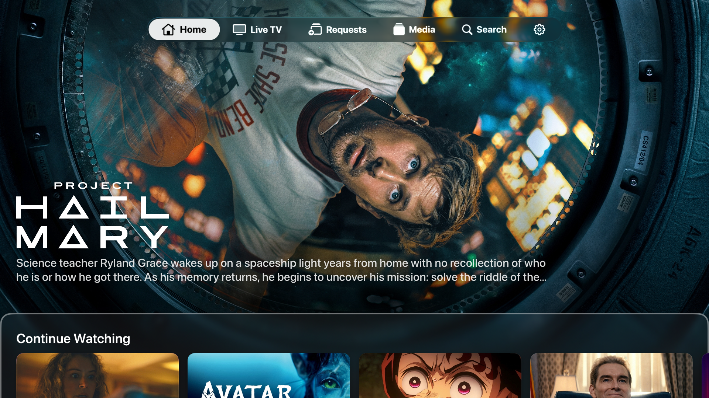 
      <b>Home</b> 
      A cinematic, full-bleed spotlight hero (powered by the Media Bar plugin) over your Continue Watching.
    </td>
    <td width="50%" valign="top">
      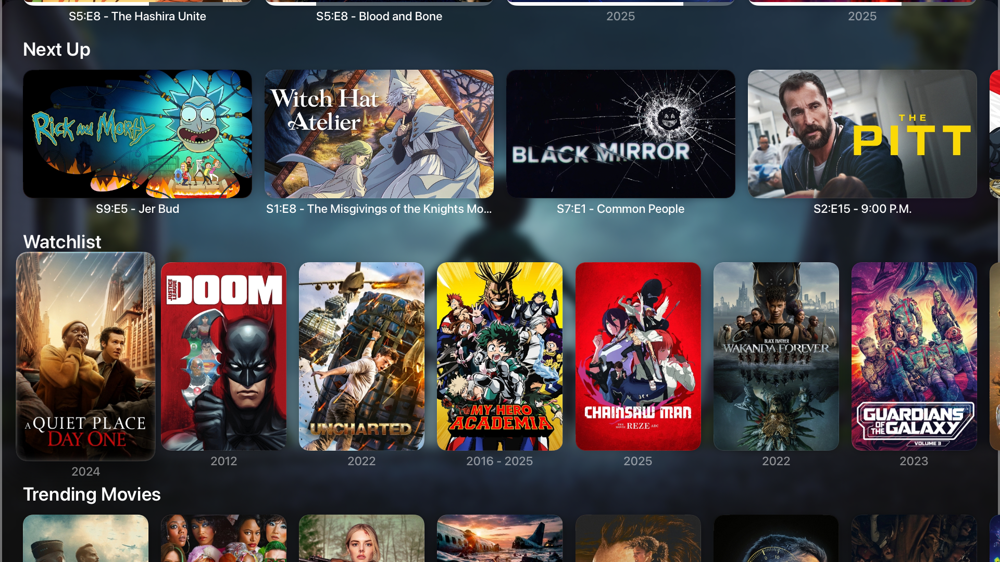 
      <b>Home rows</b> 
      Your server's Home Screen Sections / KefinTweaks layout — Next Up, Watchlist, Trending — rendered natively.
    </td>
  </tr>
  <tr>
    <td width="50%" valign="top">
      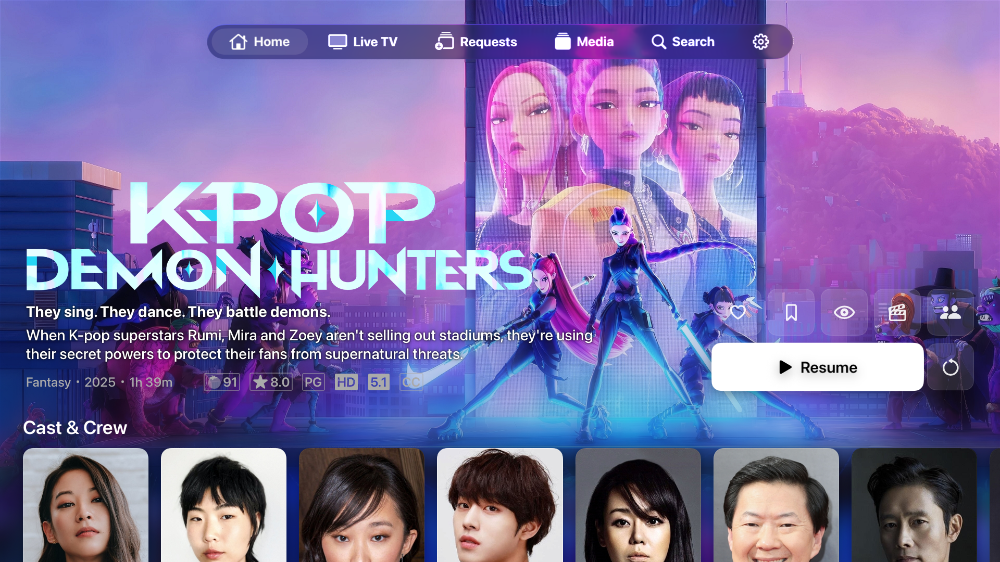 
      <b>Movies</b> 
      Cinematic detail pages with backdrop art, ratings, cast &amp; crew, and instant Resume.
    </td>
    <td width="50%" valign="top">
      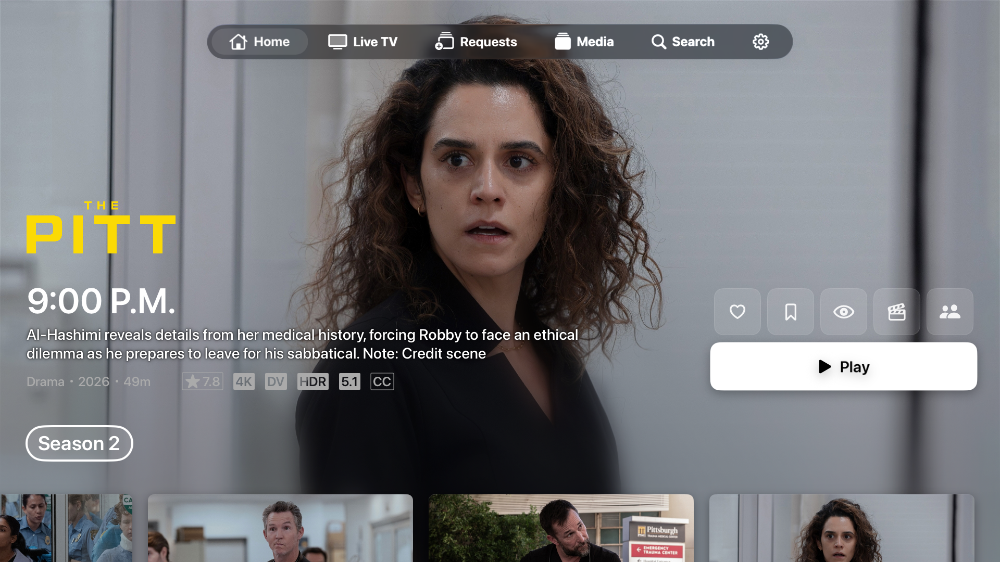 
      <b>TV shows</b> 
      Episode browsing with a season selector, per-episode artwork, and details.
    </td>
  </tr>
  <tr>
    <td width="50%" valign="top">
      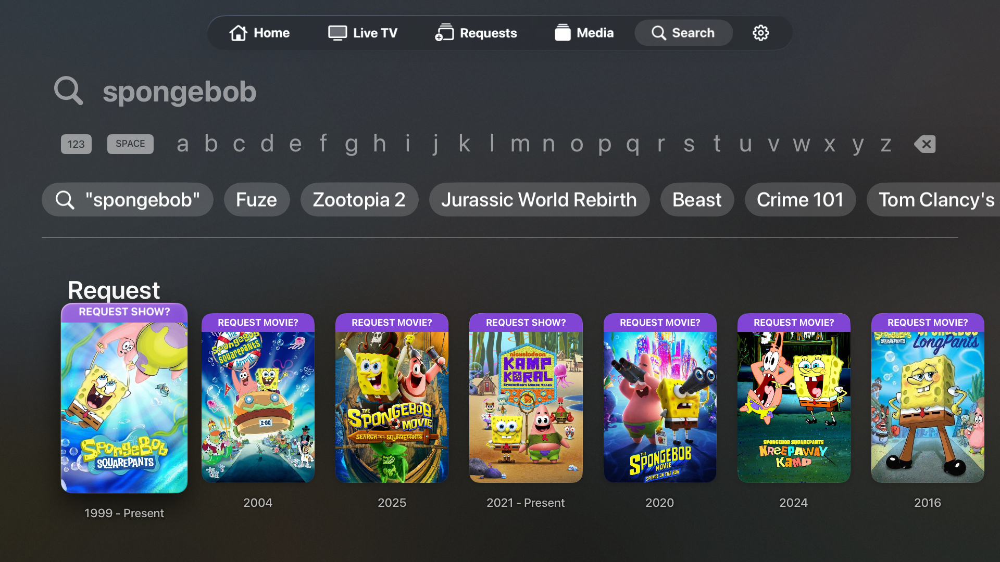 
      <b>Search</b> 
      Fast search with suggestions — and request titles you don't have right from the results (Seerr).
    </td>
    <td width="50%" valign="top">
      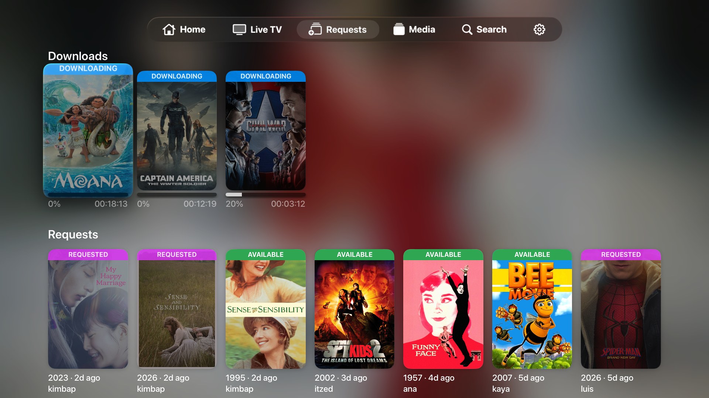 
      <b>Requests</b> 
      Track downloads and Seerr requests with live availability status.
    </td>
  </tr>
  <tr>
    <td width="50%" valign="top">
      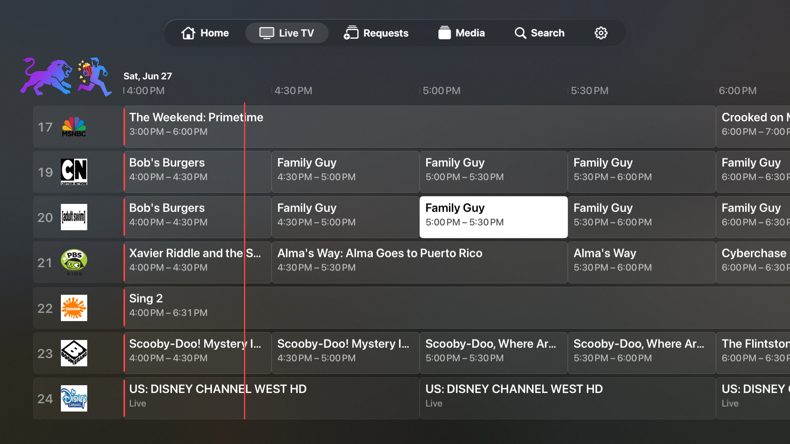 
      <b>Live TV</b> 
      A full cable-box EPG guide with channel logos, a live now-line, and smooth time scrolling.
    </td>
    <td width="50%" valign="top">
      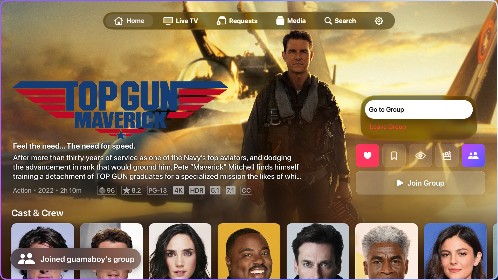 
      <b>SyncPlay</b> 
      Watch together — create or join a synced playback group right from a title.
    </td>
  </tr>
  <tr>
    <td width="50%" valign="top">
      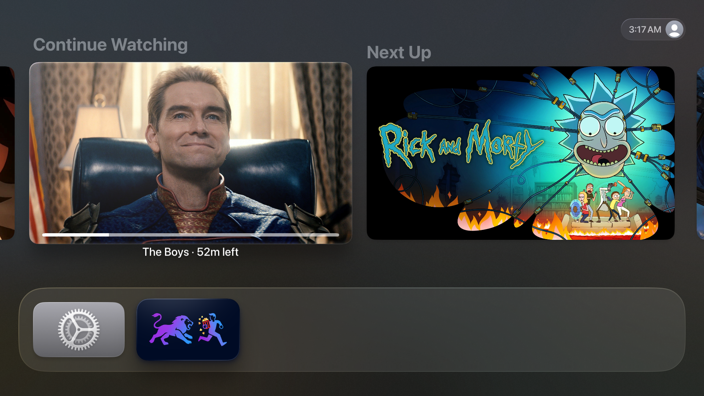 
      <b>Top Shelf</b> 
      Continue Watching and Next Up surfaced on the Apple TV Home screen.
    </td>
    <td width="50%" valign="top">
      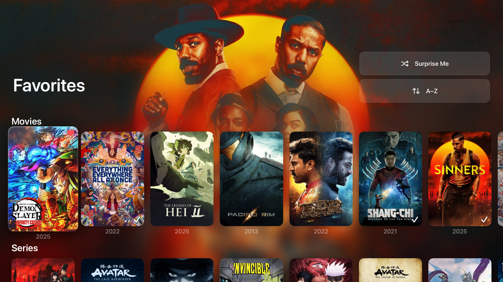 
      <b>Collections</b> 
      Favorites and Watchlist as smart collections with a rotating backdrop and quick sorting.
    </td>
  </tr>
</table>

## 🛠️ TestFlight

GuamaFlix is in **public beta** on TestFlight — try new features and fixes ahead of the App Store release. Bug reports and feedback are hugely appreciated.  
tvOS 26+ only.

> [!NOTE]
> Install Apple's **TestFlight** app, then open the link below to install Project GuamaFlix on your Apple TV 4K.

<a href="https://testflight.apple.com/join/nvA5he9b">
  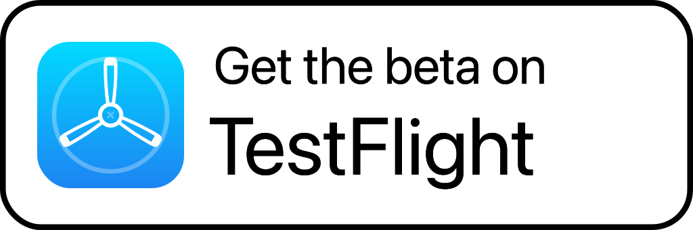
</a>

## 🧱 Built on Swiftfin

GuamaFlix stands on the excellent work of the **Swiftfin** and **Jellyfin** communities. The Jellyfin networking, models, and player foundations come from Swiftfin; GuamaFlix layers a native tvOS experience on top. The following Swiftfin docs still describe the shared foundation:

- [🎞️ Library Support](https://github.com/jellyfin/Swiftfin/blob/main/Documentation/libraries.md) — library compatibility and supported media types.
- [🎬 Media Playback](https://github.com/jellyfin/Swiftfin/blob/main/Documentation/players.md) — how the native and VLC players differ.

## 📜 License & Attribution

GuamaFlix is built on [Swiftfin](https://github.com/jellyfin/Swiftfin), which is licensed under the **Mozilla Public License 2.0 (MPL-2.0)**. Files derived from Swiftfin remain under the MPL-2.0, keep their original license headers, and their source is made available in this repository in compliance with the license.

**This repository is a source-availability mirror, not a buildable app.**

GuamaFlix is an independent project and is **not affiliated with or endorsed by** the Jellyfin or Swiftfin projects.

## 📚 Translations

Translations are inherited from Swiftfin. To help translate the underlying Swiftfin strings, see the [Jellyfin Weblate instance](https://translate.jellyfin.org/projects/swiftfin/).

---

GuamaFlix © 2026 guama.dev · Built on Swiftfin (MPL-2.0) · Jellyfin® is a trademark of the Jellyfin project.

